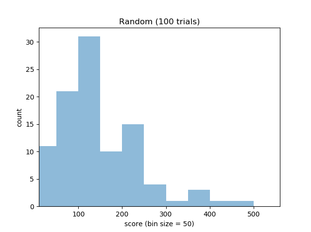
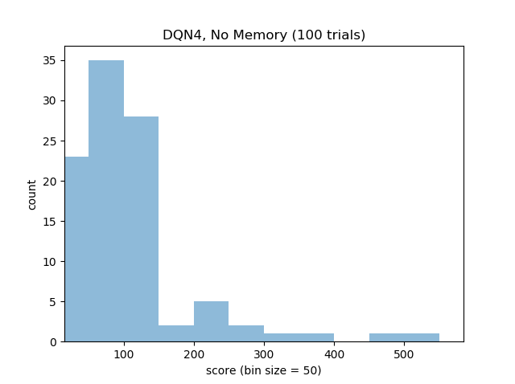
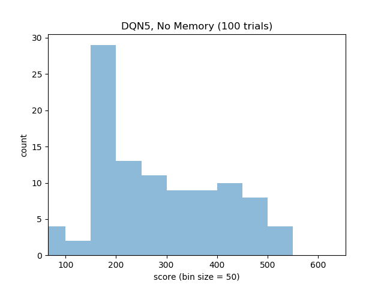
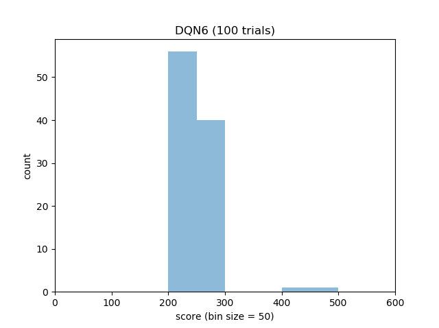

# Space Invaders DQN Test

## Installation

REQUIRES PYTHON 3

Before running the file, ensure the requirements are met as seen in 
requirements.txt.

## To Run

In order to invoke a demonstration of any of the following files:
    * space_invaders_random.py              [Random]
    * space_invaders_dqn4_NO_MEMORY.py      [DQN4]
    * space_invaders_dqn5_NO_MEMORY.py      [DQN5]
    * space_invaders_dqn6.py                [DQN6]
    
use the following command:

python [file]

## Results

Results were taken after 100 games. See REPORT.pdf for details.

Random Baseline

DQN v4 (no memory)

DQN v5 (no memory)

DQN v6

